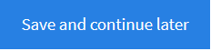

# jsalign

I developed jsalign as an editor for bilingual [parallel texts](https://en.wikipedia.org/wiki/Parallel_text) generated with [eunlp](https://github.com/filipok/eunlp). eunlp generates a two-column display of source and target sentences, currently from [Eur-Lex](http://eur-lex.europa.eu/homepage.html) documents. You can see an example [here](https://transverbis02.s3.amazonaws.com/wooey_files/celex-aligner/fb161d8e-5554-48b2-ac74-2c142a1d0fd7/bi_32013R1024_en_ro_manual.html).

The table generated by eunlp consists of one row with two columns, and each column consists of a list of divs, instead of table cells. This facilitates the insertion and deletion of text segments in the alignment. This is how it looks like when generated by the Python code in eunlp. 

```
<table class="main-table">
  <tr class="main-row">
    <td id="source-col"  ondrop="drop(event)" ondragover="allowDrop(event)">
<div class="cell" draggable="true" ondragstart="drag(event)" onmouseover="addId(this)" onmouseout="removeId(this, event)">
<span class="celltext"  contenteditable="true">29.10.2013</span></div>
    </td>
    <td id="target-col"  ondrop="drop(event)" ondragover="allowDrop(event)">
<div class="cell" draggable="true" ondragstart="drag(event)" onmouseover="addId(this)" onmouseout="removeId(this, event)">
<span class="celltext"  contenteditable="true">29.10.2013</span></div>
    </td>
  </tr>
</table>
```
When a div is active, i.e. the mouse hovers over it, certain buttons with functions are attached to that div. Those buttons are what jsalign does.

## Edit directly any segment

As the text is editable (contenteditable="true"), you can edit any segment just by positioning (clicking) the cursor inside the cell. This works best with Google Chrome and Opera. 

In the case of Internet Explorer and Firefox, the cursor gets positioned at the beginning of the segment and you have to move it with the left/right arrows.

## Add segment


This button adds a new segment below the active segment, with the boilerplate \<Add text here\>.
You can replace it with your text.
 

 
## Delete segment


This button deletes the current segment. You will be asked if you really want it.

## Merge segment


This button merges the current button with the next one. You wil be asked if you really want it.


## Split segment


With this button you can split the current segment into two segments by clicking with the mouse at the place where you want to split it. It uses [Rangy](https://github.com/timdown/rangy) for that purpose. This behavior works as described only in Google Chrome and Opera. 

In Firefox first you have to slightly drag the text in order to get the blinking cursor at its beginning. Then you have to move it with the left/right arrow to the required position. Finally, you can click on the text in order to split it.

In Internet Explorer first you have to slightly drag the text in the location where you want to split it and then you can click on it in order to split it.

I recommend sticking to Chrome and Opera if possible.

## Cut and paste buttons


If you need to change the order of the segments in the source column or in the target column, you can use the cut and paste buttons. 

There are two stages. First, you select the cell(s) you want to move with the black copy button. 

Then you select the location where you want to paste them by clicking the blue paste button in the respective cell. The moved cells will be inserted after this cell. The moved cells will be inserted in their original order. 

You cannot undo this action. 


## Drag and drop

As an alternative to the cut and paste buttons, you can use the built-in drag and drop capabilities. You can drag a cell and drop it anywhere, including in the other column.

Unfortunately, the drag and drop function does not work in Internet Explorer at the moment. 

## Save backup


Some documents can be very long. You can use the 'Save and continue later' button to save your work to a permanent file. 

Also, as there is no undo, it might be wise to use that function regularly.

# Future development

Currently, I only use the script for the alignments generated by eunlp. However, you can take the [example](https://transverbis02.s3.amazonaws.com/wooey_files/celex-aligner/fb161d8e-5554-48b2-ac74-2c142a1d0fd7/bi_32013R1024_en_ro_manual.html) and create scripts to generate parallel alignments that are compatible with jsalign, such as [TMX](https://en.wikipedia.org/wiki/Translation_Memory_eXchange) editors or subtitle editors.